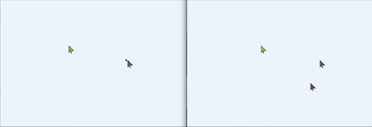

# Cursor dancer

This is a *WebSocket* project that enables real-time interaction between users. When multiple users connect, they can see the cursor movements of all other participants moving across the screen simultaneously.

The project implements a **Redis Pub/Sub** architecture to achieve horizontal scaling. By broadcasting events through Redis, users connected to different server instances can interact in real-time, allowing the application to scale across multiple nodes.

## Tech Stack

- **Node.js**: Runtime environment
- **ws**: WebSocket implementation for real-time communication
- **Redis**: Pub/Sub messaging system for cross-server synchronization
- **Docker**: Containerization for the Redis service

## How to Run

1. **Install dependencies:**
   ```bash
   pnpm install
   ```

2. **Start the Redis container:**
   ```bash
   docker compose up -d
   ```

3. **Start the server:**
   ```bash
   pnpm start
   ```

## Demo

